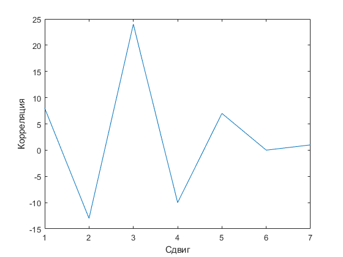
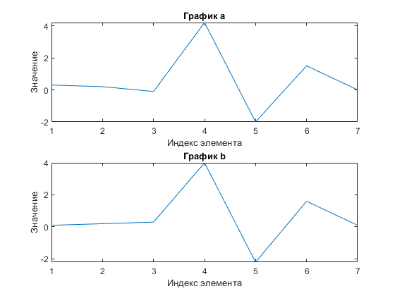

```c++
int Corr(int a[], int b[], int n) {
    int p = 0;
    for (int i = 0; i < n; i++) {
        p += a[i] * b[i];
    }
    return p;
}

double Corr2(int a[], int b[], int n) {
    float p = 0;
    int a_2 = 0;
    int b_2 = 0;

    for (int i = 0; i < n; i++) {
        p += a[i] * b[i];
        a_2 += a[i];
        b_2 += b[i];
    }
    
    return (p / (sqrt(pow(a_2,2)) * sqrt(pow(b_2,2))));
}
```

```m
f1 = 18;
f2 = f1 + 4;
f3 = f1 * 2 + 1;

time = (0:100-1)/100;

S1 = cos(2*pi* f1 *time);
S2 = cos(2*pi* f2 *time);
S3 = cos(2*pi* f3 *time);

a = 2*S1 + 4*S2 + S3;
b = 1/2 * S1 + 1/3 * S3;
```



